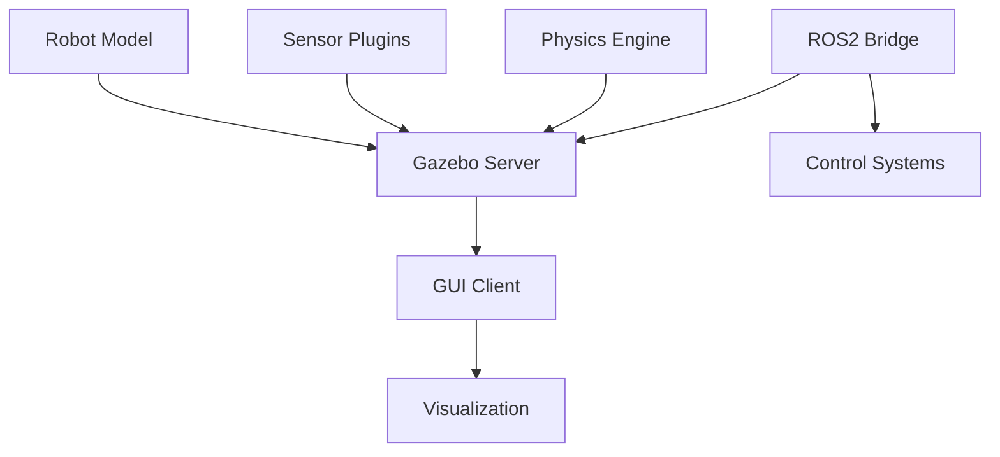
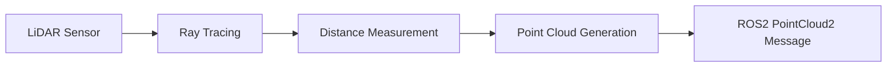

# Gazebo Simulation Environment

Gazebo is a physics-based simulation environment that provides realistic robot simulation capabilities. It enables testing of robotic algorithms in a safe, controlled environment before deployment on real hardware.

## Architecture Overview

The Gazebo simulation environment consists of several key components that work together to provide realistic physics simulation:



## Physics Simulation

Gazebo uses several physics engines to simulate real-world physics:

- **ODE (Open Dynamics Engine)**: Fast and stable, good for most applications
- **Bullet**: More accurate contact simulation
- **Simbody**: High-fidelity multibody dynamics
- **DART**: Dynamic Animation and Robotics Toolkit

### Physics Parameters

Each simulation can be configured with specific physics parameters:

```xml
<physics type="ode">
  <max_step_size>0.001</max_step_size>
  <real_time_factor>1.0</real_time_factor>
  <real_time_update_rate>1000.0</real_time_update_rate>
  <gravity>0 0 -9.8</gravity>
</physics>
```

## Sensor Simulation

Gazebo provides realistic sensor simulation for various types of sensors:

### Camera Sensors

```xml
<sensor name="camera" type="camera">
  <camera>
    <horizontal_fov>1.047</horizontal_fov>
    <image>
      <width>640</width>
      <height>480</height>
      <format>R8G8B8</format>
    </image>
    <clip>
      <near>0.1</near>
      <far>100</far>
    </clip>
  </camera>
</sensor>
```

### LiDAR Sensors

LiDAR sensors simulate 3D point cloud data:



## World Modeling

Gazebo worlds are defined using SDF (Simulation Description Format):

```xml
<sdf version="1.7">
  <world name="default">
    <include>
      <uri>model://ground_plane</uri>
    </include>
    <include>
      <uri>model://sun</uri>
    </include>
    <model name="robot">
      <!-- Robot definition -->
    </model>
  </world>
</sdf>
```

## Integration with ROS2

Gazebo integrates seamlessly with ROS2 through:

- **Gazebo ROS packages**: Bridge between Gazebo and ROS2
- **Plugins**: Custom plugins for specific robot functionality
- **Launch files**: Integration with ROS2 launch system

## Performance Optimization

To optimize simulation performance:

- Use appropriate physics engine for your use case
- Adjust update rates based on required fidelity
- Simplify collision meshes where possible
- Use level-of-detail (LOD) models

:::tip
For real-time simulation, aim for physics update rates of 1000 Hz and real-time factors of 1.0 or higher.
:::

## Troubleshooting Common Issues

### Slow Simulation

- Reduce physics update rate
- Simplify collision models
- Reduce number of active sensors

### Unstable Physics

- Reduce max step size
- Adjust solver parameters
- Check mass and inertia properties

## Best Practices

1. **Start Simple**: Begin with basic models and add complexity gradually
2. **Validate Physics**: Ensure mass, inertia, and friction parameters match real robot
3. **Use Appropriate Fidelity**: Match simulation fidelity to testing requirements
4. **Document Worlds**: Maintain clear documentation of simulation environments

## Conclusion

Gazebo provides a powerful platform for robot simulation and testing. By understanding its architecture and capabilities, you can create realistic simulation environments that effectively bridge the gap between development and real-world deployment.

:::note
Simulation is a powerful tool, but always plan for the differences between simulation and reality when transitioning to real hardware.
:::